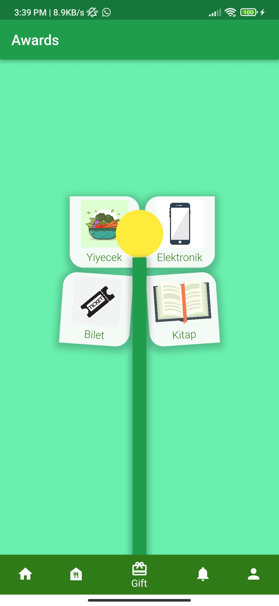
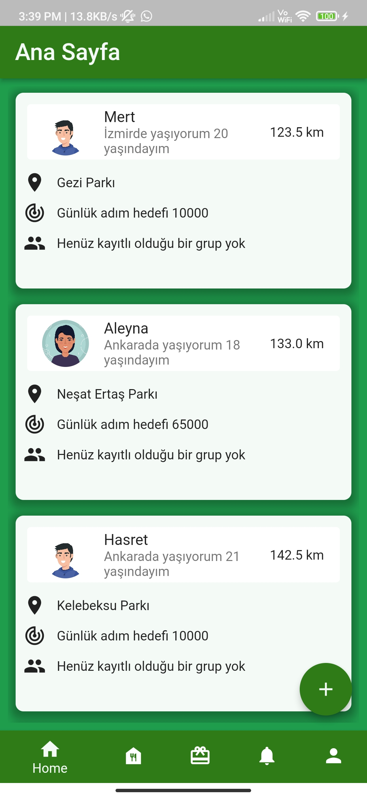
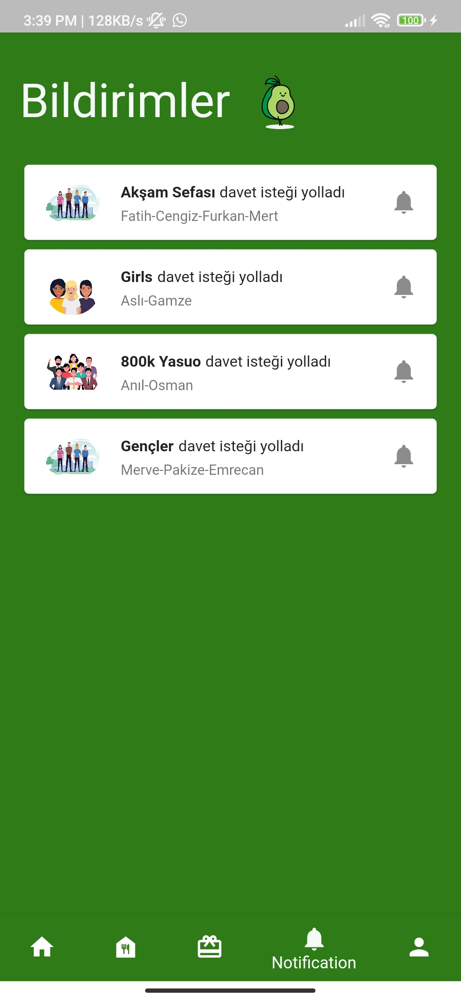
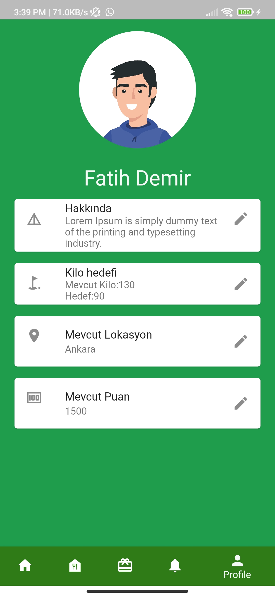
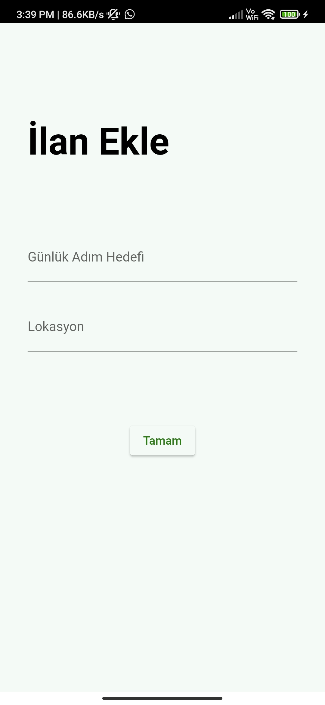
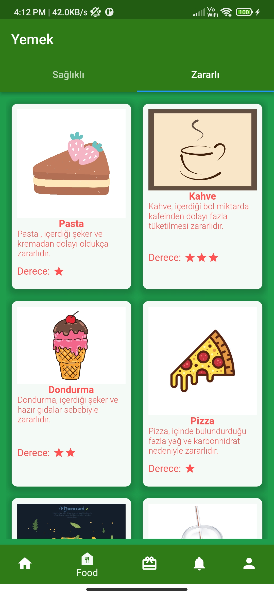
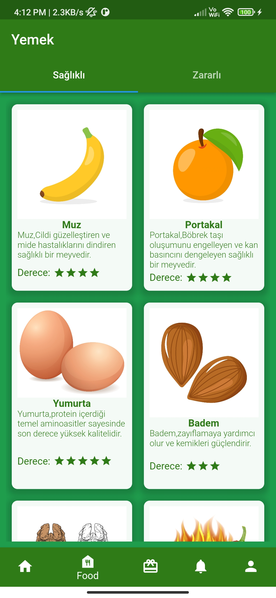
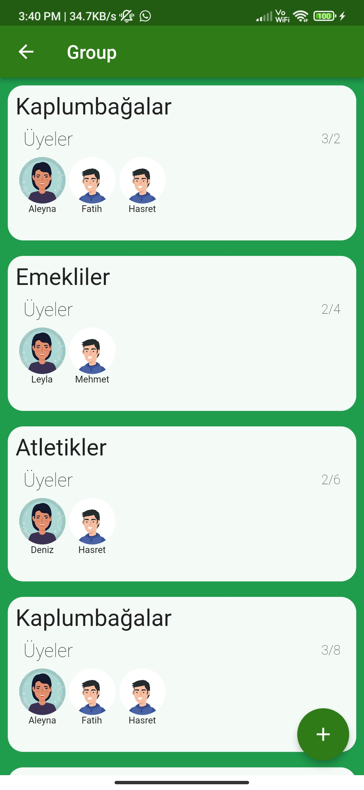

# Meetify 
## Flutter Hackathon 2022

    

Son 200 yılda makineleşme ve teknoloji devrimi hayatlarımızı tahmin edilemez biçimde değiştirmiş ve birçok şeyi kolaylaştırırken beraberinde hafife alınamaz ciddi sorunlar getirmiştir. Değişim o kadar çarpıcı olmuştur ki , sayısı hala artmakta olan büyük bir insan popülasyonunun sağlıkları büyük ölçüde etkilenmiştir. Bu etkinin en gözle görülür sonuçları olan obezite ve ruhsal hastalıkları engellemek ve bir nebze de olsa tedavi edebilmek amacıyla “Sağlık ve Kaliteli Yaşam” ilkesini benimseyen Meetify’ı tasarladık. Meetify uygulaması ile kullanıcı çeşitli arkadaş gruplarına katılabilir ve beraber belirledikleri bir güzergahta hem sosyalleşip hem de yürüyüş yaparak, fiziksel ve zihinsel olarak sağlıklı olabilirler. Projemiz, gelecekte getirecek olduğumuz farklı spor aktiviteleri ve sosyal sorumluluk projeleri ile hedef kitlesini genişletip, daha fazla insanın hayatına olumlu yönden etki etmeyi hedefliyor.

# Projede kullanılan araçlar

* AdobeXD

# Projede kullanılan Flutter paketleri

* cupertino_icons: ^1.0.2
* lottie
* provider
* hive_flutter
* kartal
* google_fonts
* flutter_lints
* build_runner
* hive_flutter
* hive_generator
* test  
* flutter_launcher_icons  

